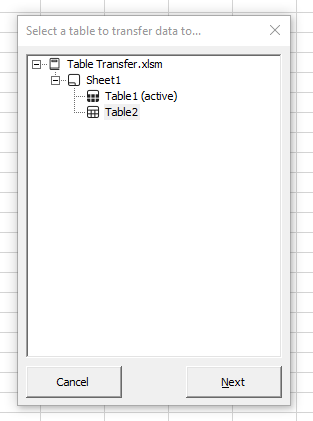
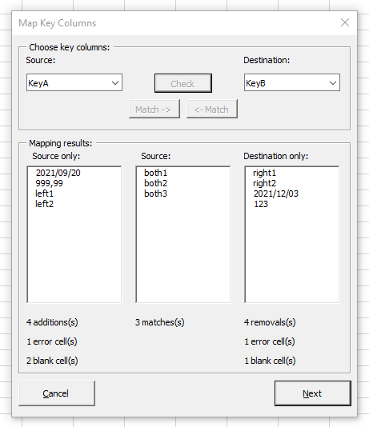
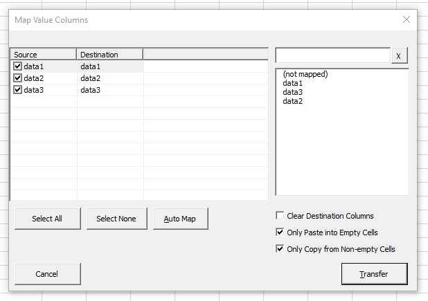

# excel-table-transfer
Tool for transferring data between Excel tables

> **WARNING:** Transfer operations by macros cannot be reversed using the Undo feature of Excel. Always backup your data beforehand!

## Background
At work we spend a lot of time using VLOOKUP, XLOOKUP, and other techniques such as INDEX(MATCH()) to copy data between spreadsheets. 

Some of the issues we faced were:

1. Having to manually check that all the keys were present in both sheets.
2. Ensuring that each key appeared exactly once in each sheet.
3. Incremental updates — i.e. only updating cells in the destination sheet which were blank.
4. Ignoring blank cells in the source sheet — i.e. not replacing existing data in the destination sheet with blank cells from the source sheet.
5. Having to do the above for multiple columns, which are not necessarily in the same order, or with the same name.

## Table Transfer Tool

The tool is made up of three parts:

### Table Browser

This lets you select the destination table to which you are transferring data. 

### Map Key Columns

This lets you choose the key columns in the source and destination tables.

Two `Match` buttons allow you to select the matching column name from the opposite table.

The `Check` button compares the keys in the two columns. 

The three results listboxes show a list of keys that appear only in the source table, a list of common keys (the intersection), and a list of keys only visible in the destination column. This allows you to easily see if keys have been added or removed.

Lastly, we give a count of how many blank keys and how many error (#N/A, etc.) keys were found.

### Map Value Columns

This lets you choose which columns are mapped between the two tables. 

The `Auto Map` column maps all columns which share the same name.

`Select All` and `Select None` are self-explanatory.

`Clear Destination columns` empties *all* values in the mapped columns, even if the keys do not match.

`Only Paste into Empty cells` ensures that existing data in the destination table is not replaced.

`Only Copy from Non-empty cells` prevents blank cells in the source table from overwriting non-blank data in the destination.

## Code

The heart of the tool is the `modTransferInstruction` module. It uses the instructions in a struct to copy the data from one table to another. 

This module, and all the forms' modules, rely on the `modArrayEx` module to analyse the two modules as sets, in order to find the intersection, difference, duplicate keys, uniques keys, etc.

Much of the logic for the three forms was hastily written and still needs to be decoupled cleanly.

## Filters

One issue we ran into was the state of tables when filtering: caution needs to be taken when attempting to paste data into a table that has been filtered. 

Our strategy was to store the state of the current filter, disable it, paste the data, then restore the state. This is non-trivial, as there is no built-in way to easily toggle the filter, or to (de)serialize the filter state.

## TODO

* Decouple form code from the UI
* Option to insert new keys
* Option to remove keys not present in source table (or blank out the mapped fields, or all non-key fields)
* Optional formatting of transferred data (highlight new keys, removed keys, each replaced cell)
* Store a history of transfer operations in a VeryHiddenWorksheet, so that they can be repeated more easily
* Add rest of metrics for column quality (similar to PowerBI)