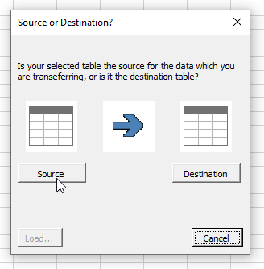
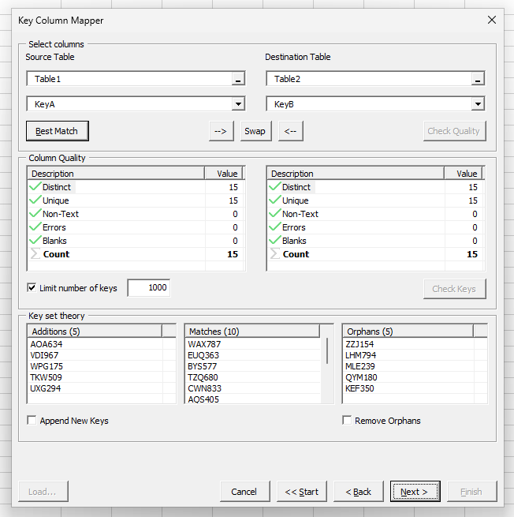
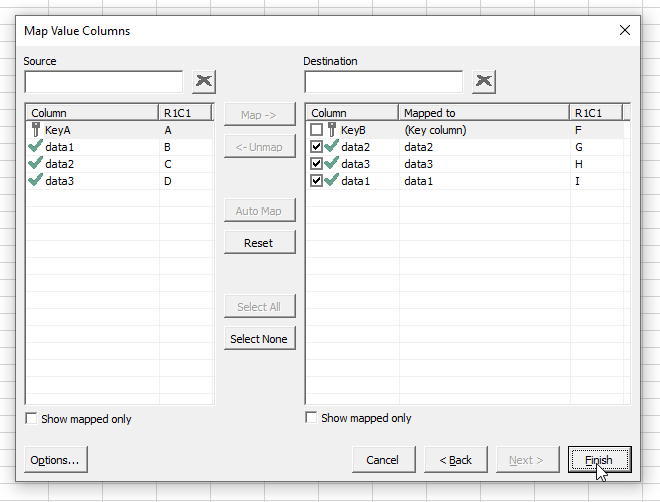
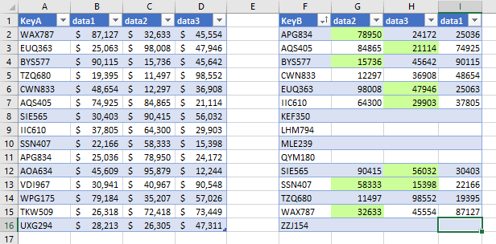

# excel-table-transfer
A tool for transferring data between Excel tables.

> **WARNING:** Transfer operations by macros cannot be reversed using the Undo feature of Excel. Always backup your data beforehand!

## Scenario

Suppose your boss hands you an Excel "database" of 10'000 rows, and a second spreadsheet that needs to be updated. How would you go about this task?

"`VLOOKUP`" the seasoned Excel boffin might say. 

However, you then need to ensure that every row in your destination found match in the source, via filtering for `#N/A`. Easy enough. But what if there were duplicate keys in the source? Now you need to use Conditional Formatting to Highlight Duplicates, then Filter by that colour. And what if you require all the keys in the source to be present in the destination - what if new rows were added? Now you need to perform the same `VLOOKUP`, but in the opposite direction.

And how do you handle blank cells? Do you just Paste as Value, then Search & Replace for zero (entire cell) into a blank?

Let's spice things up a bit more: what if you have an existing column, and only want to `VLOOKUP` the blank cells? Now you need to `VLOOKUP` to a second column, perform IF conditionals, then update the original column. 

Or what if you want to update all the values, but keep track of which ones changed? Or perhaps you are updating from an incomplete source, and do not want blanks in there to overwrite data you already have? Or perhaps the author applied some filters, and you are only instructed to update the filtered rows: do you Select Visible and copy to a new temporary sheet?

What would your solution be if you had to perform this task with not one column, but ten? Or twenty? And what if it was not just one source spreadsheet, but a dozen? The smart thing would be to consolidate the source sheets and then combine them - but what if you had a deadline and can't wait for the last straggler?

The obvious solution would be to invest in a Real:tm: database, but unfortunately, for many this is not an option. And thus, this project was born.
## Background
At work we spend a lot of time using VLOOKUP, XLOOKUP, and other techniques such as INDEX(MATCH()) to copy data between spreadsheets. 

Some of the issues we faced were:

1. Having to manually check that all the keys were present in both sheets.
2. Ensuring that each key appeared exactly once in each sheet.
3. Incremental updates — i.e. only updating cells in the destination sheet which were blank.
4. Ignoring blank cells in the source sheet — i.e. not replacing existing data in the destination sheet with blank cells from the source sheet.
5. Having to do the above for multiple columns, which are not necessarily in the same order, or with the same name.

## Table Transfer Tool

The tool is made up of four parts:

### Source or Destination dialog

If you start the tool with a table selected, it prompts you as to whether it is the source or the destination.

### Map Key Columns

This lets you choose the key columns in the source and destination tables.

`Best Macth` checks all the columns in both tables, attempts to identify unique columns, then calculates which pair has the best match between the two tables.

`Column Quality` lists the metrics of your chosen key columns. Ideally it should be entirely distinct with no blank or error cells.

`Key Set Theory` compares the two key column fields to check how well they match. It returns a list of the intersecting keys (i.e. present in both tables), as well as two lists of keys only present in one table. You can opt to append the additions to your destination table, and opt to remove orphaned rows from it

### Map Value Columns

This lets you choose which columns are mapped between the two tables. 

`Auto Map` will attempt to match columns by name. It is now smart enough to not automatically attempt to overwrite columns with formulae in them.

The rest of the interface should be self-explanatory.

### Options

Options dialog. Self-explanatory.

### Results

Below you can see a sample being mapped. 

The Key columns have different names, but are still automatically matched based on their contents.

No attempt is made to map rows that are not present in the source table, as per our settings.

Despite the columns being in a different order, they are still mapped based on their names.

Only changes are transferred across, and highlighted accordingly.

