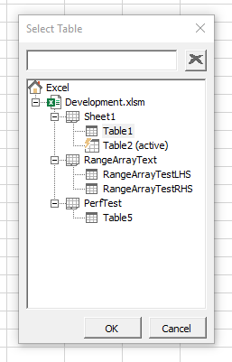
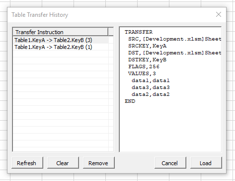

# excel-table-transfer
A tool for transferring data between Excel tables.

> **WARNING:** Transfer operations by macros cannot be reversed using the Undo feature of Excel. Always backup your data beforehand!

## Background
At work we spend a lot of time using VLOOKUP, XLOOKUP, and other techniques such as INDEX(MATCH()) to copy data between spreadsheets. 

Some of the issues we faced were:

1. Having to manually check that all the keys were present in both sheets.
2. Ensuring that each key appeared exactly once in each sheet.
3. Incremental updates — i.e. only updating cells in the destination sheet which were blank.
4. Ignoring blank cells in the source sheet — i.e. not replacing existing data in the destination sheet with blank cells from the source sheet.
5. Having to do the above for multiple columns, which are not necessarily in the same order, or with the same name.

## Table Transfer Tool

The tool is made up of three parts:

### Table Browser

This lets you select the source table from which you are retrieving data. 

### Map Key Columns

This lets you choose the key columns in the source and destination tables.

`Check Quality` checks to ensure that the Key Columns are unique, and that they do not contain any errors, or non-text values.

`Check Keys` compares the two key column fields to check how many keys are matched in both columns, how many are in the source table only, and how many are in the destination only.

### Map Value Columns

This lets you choose which columns are mapped between the two tables. 

`Auto Map` will attempt to match columns by name. The rest of the interface should be self-explanatory.

### Options

Options dialog. Self-explanatory.

### History

The tool can optionally store a record of every transfer that is successful. This allows us to recall previous transfers and run them again.

