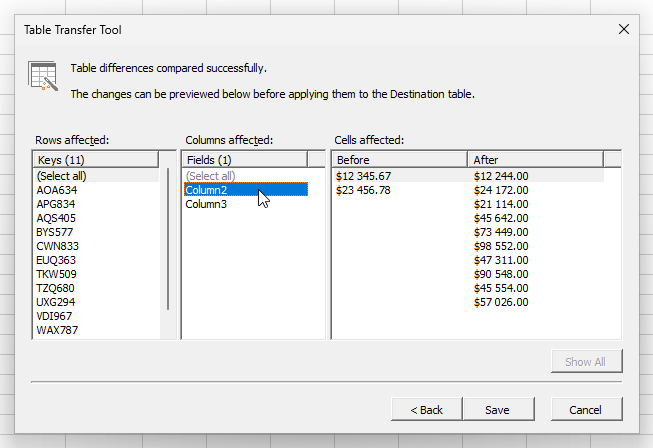
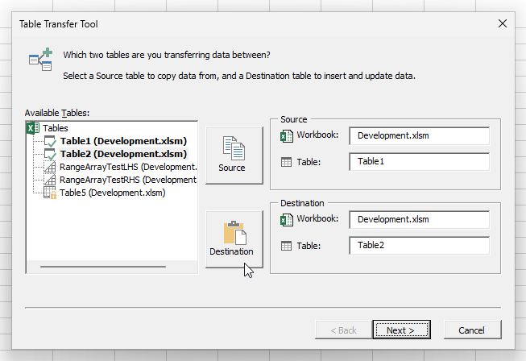
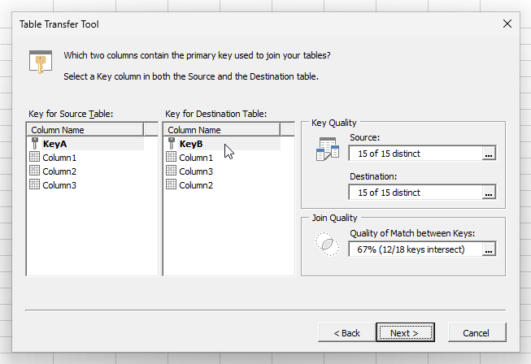
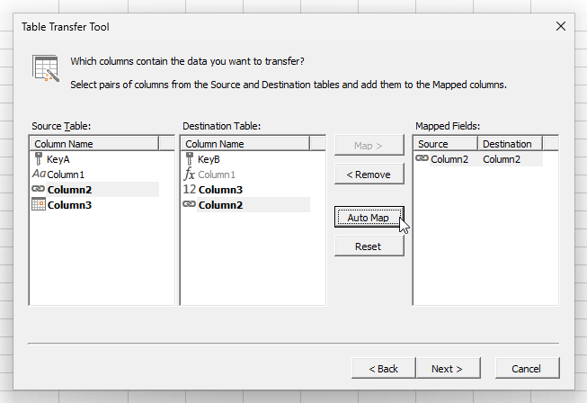

# Excel Table Transfer Tool
A tool for transferring data between Excel tables.

> **WARNING:** Transfer operations by macros cannot be reversed using the Undo feature of Excel. Always backup your data beforehand!

## 🧰 Features
- Transfer data from one table to another without using formulas.
- Check if keys are a 1:1 match between tables, detecting orphans, additions and duplicates.
- Only update rows where the key is present in both tables.
- Automatically map all columns with the same name. 
- Highlight changed and unchanged data.

## 📸 Screenshots
### Table Picker

### Key Mapper

### Value Mapper

## 📝 Change Log
- [Change Log](Notes/ChangeLog.md)
- [History behind Table Transfer Tool](Notes/History.md)